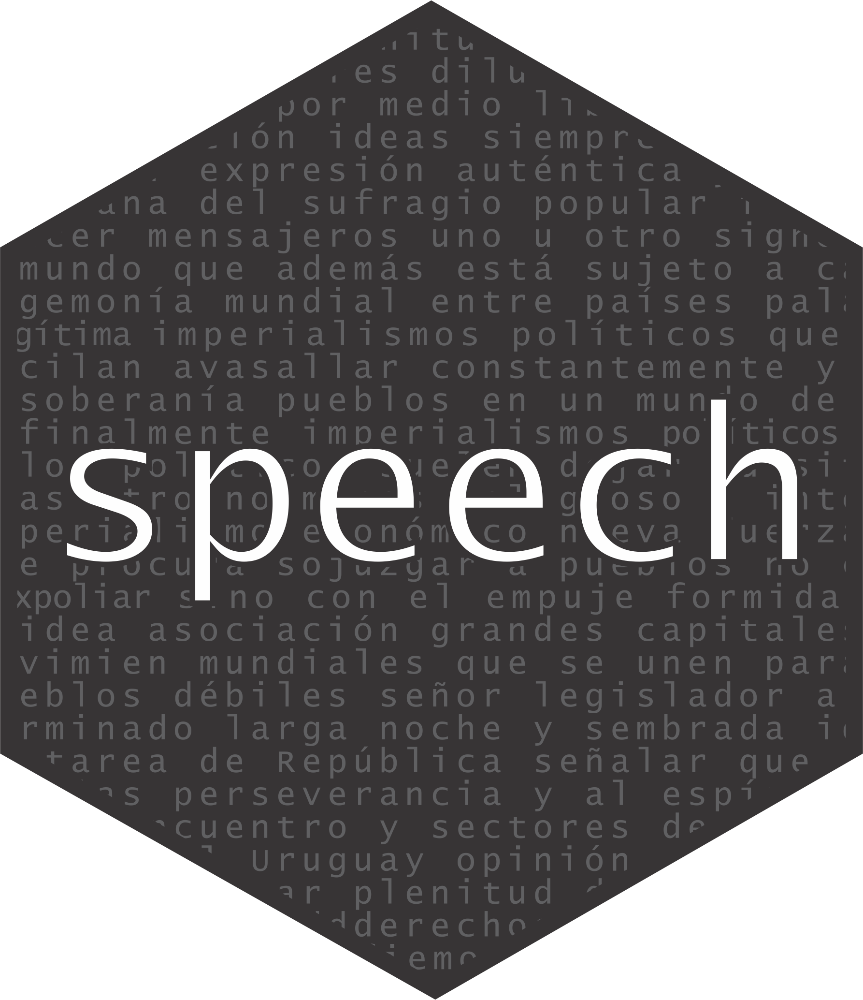

```{r, include = FALSE}
knitr::opts_chunk$set(
  collapse = TRUE,
  comment = "#>",
  fig.path = "man/figures/README-",
  out.width = "80%"
)
```

## Ejemplos en español del paquete `speech` 

_Nicolas Schmidt, Diego Lujan, Juan Andres Moraes_


### Description

Converts the floor speeches of Uruguayan legislators, extracted from the parliamentary minutes, to tidy data.frame where each observation is the intervention of a single legislator.


### Example

```{r example}
library(speech)
url <- "https://parlamento.gub.uy/documentosyleyes/documentos/diario-de-sesion/comisionpermanente/6084/IMG/0?width=800&height=600&hl=en_US1&iframe=true&rel=nofollow"
text <- speech::speech_build(file = url)
text


```


