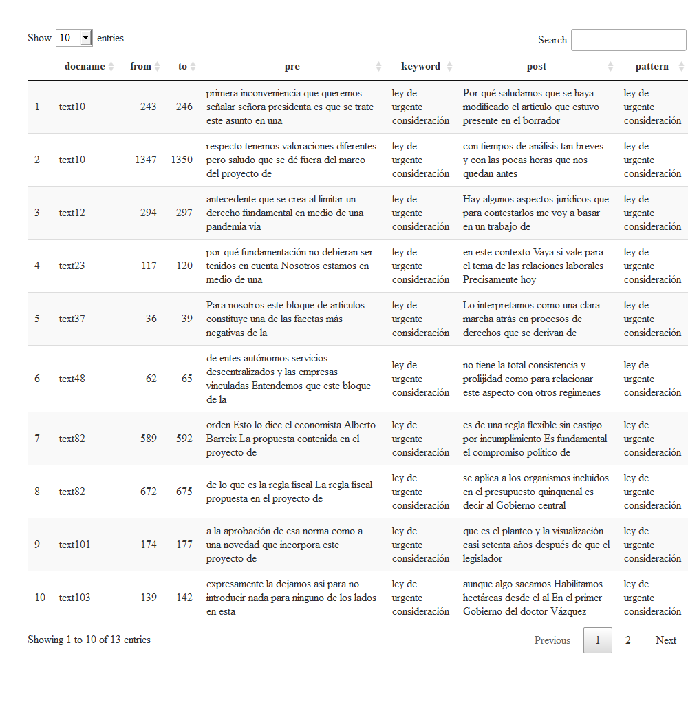

## Ejemplos y usos del paquete `speech` :page\_with\_curl: 

*Nicolás Schmidt*, *Elina Gómez*


### Índice

-   [Descripción del paquete `speech`](#descripción)
-   [Características del paquete `speech`](#características)
-   [Ejemplos](#ejemplos)
    -   [Ejemplo 1: Primer sesión desde la restauración
        democrática](#ejemplo-1)
    -   [Ejemplo 2: Sesión sobre creación de Consejos de
        Salarios](#ejemplo-2)
    -   [Ejemplo 3: Sesión reciente de la Comisión
        Permanente](#ejemplo-3)
    -   [Ejemplo 4: Descarga de sesiones según rango
        temporal](#ejemplo-4)
-   [Posibles aplicaciones (nube de palabras, tópicos en contexto y
    análisis de sentimientos)](#posibles-aplicaciones)
-   [Usos de `speech`](#usos)
-   [Aplicación web de `speech` y `puy`](#aplicación-web)

### Descripción

El paquete
[`speech`](https://nicolas-schmidt.github.io/speech/index.html) permite
convertir diarios de sesión del parlamento uruguayo en formato PDF a
bases de datos ordenadas en la que cada fila es la intervención de cada
uno de los legisladores que interviene en esa sesión. Asimismo, dado que
los diarios de sesión muchas veces son imágenes escaneadas y que en el
proceso de OCR (reconocimiento óptico de caracteres por su sigla en
inglés) se puede perder o dañar la información recuperada, el paquete
provee un conjunto de funciones que ayudan a mejorar problemas de este
tipo.

### Características

Este paquete ordena todas las intervenciones por sesión de cada uno de
los **legisladores**. Esto quiere decir que todas las intervenciones de
los *presidentes*, *secretarios*, *ministros* o personas invitadas no
identificadas como legisladores no van a ser recuperadas por el
algoritmo de recuperación del texto del PDF. Muchas veces puede suceder
que el algoritmo no identifique claramente alguna de estas
intervenciones (que se identifican y se eliminan). En esos casos la
función con la que se pasa de un archivo con extensión `.pdf` a un
`data.frame`
([`speech_build()`](https://nicolas-schmidt.github.io/speech/reference/speech_build.html))
tiene un argumento (`rm.error.leg`) que permite incorporar esos casos
que se desean eliminar y no fueron identificados por la función.

Algo similar puede suceder con los legisladores. Una opción es que se
use la función y que cada fila de la base de datos sea cada una de las
intervenciones de cada legislador en cada momento. Esto quiere decir que
se va a tener tantas intervenciones por legislador como cuantas
intervenciones haya realizado en esa sesión. La otra opción (usando
[`speech_build(., compiler = TRUE)`](https://nicolas-schmidt.github.io/speech/reference/speech_build.html)
o
[`speech_recompiler()`](https://nicolas-schmidt.github.io/speech/reference/speech_recompiler.html))
es que cada fila de la base de datos sen todas las intervenciones juntas
en una misma sesión de cada legislador o legisladora. El problema que
puede surgir en con esta opción es que la **unión** de intervenciones se
hace por legislador y si en el proceso de recuperación del texto el
nombre de algún legislador no aparece escrito correctamente la
compilación no va a reconocer a ese legislador que es el mismo, pero
está escrito de distintas maneras. Para solucionar estos problemas y
poder compilar el paquete tiene una función que permite arreglar este
problema:
[`speech_legis_replace()`](https://nicolas-schmidt.github.io/speech/reference/speech_recompiler.html).

## Ejemplos

Es importante tener presente que la lectura del texto de los archivos
PDF de los diarios de sesión no es siempre clara. Muchos de los diarios
de sesión que están en la página
[**web**](https://parlamento.gub.uy/documentosyleyes/documentos/diarios-de-sesion)
del parlamento están escaneados.

En algunas ocasiones antes de convertir el documento PDF que contiene un
diario de sesión mediante el uso de la función
[`speech_build()`](https://nicolas-schmidt.github.io/speech/reference/speech_build.html)
va a ser necesario pasar el PDF por un OCR (reconocimiento óptico de
caracteres por su sigla en inglés).

Lo primero que hay que hacer en caso de no tener instalado el paquete es
instalarlo. En la web del paquete debe verificar cual es la última
versión. Si el número de versión de CRAN coincide con la de GitHub
instale la de CRAN caso contrario instale la versión de GitHub. Esto lo
puede verificar en las etiquetas (badges) que aparecen abajo a la
derecha en la web del
[paquete](https://nicolas-schmidt.github.io/speech/index.html).

Versión de CRAN:

``` r
install.packages("speech")
```

Versión de GitHub:

``` r
if (!require("remotes")) install.packages("remotes")
remotes::install_github("Nicolas-Schmidt/speech")
```

Una vez instalado el paquete debe cargarlo en la sesión de trabajo:

``` r
library(speech)
```

Vamos a ver 3 ejemplos que presentan distintos problemas y niveles de
complejidad en su procesamiento:

-   El diario de sesión de la Asamblea General de la reapertura
    democrática: 15 de febrero de 1985.  
-   Un diario de sesión sobre la creación de los consejos de salarios
    del 13 de octubre de 1941.  
-   Un diario de sesión reciente de una sesión convencional de la
    Comisión Permanente del 17 de setiembre de 2019

### Ejemplo 1

###### :arrow\_forward: El primer diario de sesión de la Asamblea General desde la reapertura democrática: 15 de febrero de 1985.

Lo primero que vamos a hacer es buscar la url al diario de sesión con el
que queremos trabajar o los descargamos en el argumento `file` ponemos
el nombre del archivo pdf con el que lo guardamos. Hecho eso vamos
directo a la función principal que es por donde se empieza. Vamos a
usarla sin el argumento `compiler` para detectar posibles problemas como
los comentados en la sección anterior.

``` r
url <- "https://parlamento.gub.uy/documentosyleyes/documentos/diario-de-sesion/asambleageneral/1/IMG/0?width=800&height=600&hl=en_US1&iframe=true&rel=nofollow"

text <- speech::speech_build(file = url)

print(text, n = nrow(text))
#> # A tibble: 28 x 7
#>    legislator        speech       chamber  date       legislature id         sex
#>    <chr>             <chr>        <chr>    <date>           <int> <chr>    <dbl>
#>  1 PEREYRA           "SEÑOR PER.~ ASAMBLE~ 1985-02-15          42 0?width~     1
#>  2 CORDOSO           "SEÑOR CORD~ ASAMBLE~ 1985-02-15          42 0?width~     1
#>  3 ROSSI PASSINA     "SEÑOR ROSS~ ASAMBLE~ 1985-02-15          42 0?width~     1
#>  4 TOURNE            "SEÑOR TOUR~ ASAMBLE~ 1985-02-15          42 0?width~     1
#>  5 TOURNE            "SEÑOR TOUR~ ASAMBLE~ 1985-02-15          42 0?width~     1
#>  6 TOURNE            "SEÑOR TOUR~ ASAMBLE~ 1985-02-15          42 0?width~     1
#>  7 FERREIRA          "SEÑOR FERR~ ASAMBLE~ 1985-02-15          42 0?width~     1
#>  8 FElRREIRA Señ     "SEÑOR FElR~ ASAMBLE~ 1985-02-15          42 0?width~     1
#>  9 RODRIGUEZ CAMUSSO "SEÑOR RODR~ ASAMBLE~ 1985-02-15          42 0?width~     1
#> 10 RODRIGUEZ CAMUSSO "SEÑOR RODR~ ASAMBLE~ 1985-02-15          42 0?width~     1
#> 11 TOURNE            "SEÑOR TOUR~ ASAMBLE~ 1985-02-15          42 0?width~     1
#> 12 TOURNE            "SEÑOR TOUR~ ASAMBLE~ 1985-02-15          42 0?width~     1
#> 13 PAZ AGUIRRE       "SEÑOR PAZ ~ ASAMBLE~ 1985-02-15          42 0?width~     1
#> 14 PAZ AG            "SEÑOR PAZ ~ ASAMBLE~ 1985-02-15          42 0?width~     1
#> 15 CIGLIUTI          "SEÑOR CIGL~ ASAMBLE~ 1985-02-15          42 0?width~     1
#> 16 CIGLIUTI          "SEÑOR CIGL~ ASAMBLE~ 1985-02-15          42 0?width~     1
#> 17 TOURNE            "SEÑOR TOUR~ ASAMBLE~ 1985-02-15          42 0?width~     1
#> 18 TOURNE            "SEÑOR TOUR~ ASAMBLE~ 1985-02-15          42 0?width~     1
#> 19 PIRIESIDENTE      "SEÑOR PIRI~ ASAMBLE~ 1985-02-15          42 0?width~     1
#> 20 TOURNE            "SEÑOR TOUR~ ASAMBLE~ 1985-02-15          42 0?width~     1
#> 21 TOURNE            "SEÑOR TOUR~ ASAMBLE~ 1985-02-15          42 0?width~     1
#> 22 TOURNE            "SEÑOR TOUR~ ASAMBLE~ 1985-02-15          42 0?width~     1
#> 23 PAZ AGUIRRE       "SEÑOR PAZ ~ ASAMBLE~ 1985-02-15          42 0?width~     1
#> 24 PAZ AGUIRRE       "SEÑOR PAZ ~ ASAMBLE~ 1985-02-15          42 0?width~     1
#> 25 V AILLANT         "SEÑOR V AI~ ASAMBLE~ 1985-02-15          42 0?width~     1
#> 26 VAILLANT          "SEÑOR VAIL~ ASAMBLE~ 1985-02-15          42 0?width~     1
#> 27 TOURNE            "SEÑOR TOUR~ ASAMBLE~ 1985-02-15          42 0?width~     1
#> 28 TOURNE            "SEÑOR TOUR~ ASAMBLE~ 1985-02-15          42 0?width~     1
```

Si bien la base de datos llamada `text` luce bien (hay legisladores, se
reconoció la cámara, la fecha…) se aprecian varios problemas que son
producto de la lectura del documento. Este documento está escaneado y
hay caracteres que no se leen correctamente: por ejemplo, legislador 7 y
8 parecen ser el mismo, pero al compilar los datos no se van a juntar ya
que no están escritos igual; el legislador 25 y 26 es el mismo solo que
en el primer caso hay un espacio en medio del apellido de uno de los
legisladores. El legislador 13, 23 y 24 parecen ser el mismo que el 14.

También se aprecia que hay un *‘legislador’* que no es legislador y que
no debería aparecer: el 19: *‘PIRIESIDENTE’*.

Comencemos por el ultimo problema. La función
[`speech_build()`](https://nicolas-schmidt.github.io/speech/reference/speech_build.html)
tiene un argumento que permite eliminar ‘legisladores’ que no queremos
en nuestra base de datos: `rm.error.leg`

``` r
text <- speech::speech_build(file = url, rm.error.leg = "PIRIESIDENTE")

## verificamos que ya no esté

print(text, n = nrow(text))
#> # A tibble: 27 x 7
#>    legislator        speech       chamber  date       legislature id         sex
#>    <chr>             <chr>        <chr>    <date>           <int> <chr>    <dbl>
#>  1 PEREYRA           "SEÑOR PER.~ ASAMBLE~ 1985-02-15          42 0?width~     1
#>  2 CORDOSO           "SEÑOR CORD~ ASAMBLE~ 1985-02-15          42 0?width~     1
#>  3 ROSSI PASSINA     "SEÑOR ROSS~ ASAMBLE~ 1985-02-15          42 0?width~     1
#>  4 TOURNE            "SEÑOR TOUR~ ASAMBLE~ 1985-02-15          42 0?width~     1
#>  5 TOURNE            "SEÑOR TOUR~ ASAMBLE~ 1985-02-15          42 0?width~     1
#>  6 TOURNE            "SEÑOR TOUR~ ASAMBLE~ 1985-02-15          42 0?width~     1
#>  7 FERREIRA          "SEÑOR FERR~ ASAMBLE~ 1985-02-15          42 0?width~     1
#>  8 FElRREIRA Señ     "SEÑOR FElR~ ASAMBLE~ 1985-02-15          42 0?width~     1
#>  9 RODRIGUEZ CAMUSSO "SEÑOR RODR~ ASAMBLE~ 1985-02-15          42 0?width~     1
#> 10 RODRIGUEZ CAMUSSO "SEÑOR RODR~ ASAMBLE~ 1985-02-15          42 0?width~     1
#> 11 TOURNE            "SEÑOR TOUR~ ASAMBLE~ 1985-02-15          42 0?width~     1
#> 12 TOURNE            "SEÑOR TOUR~ ASAMBLE~ 1985-02-15          42 0?width~     1
#> 13 PAZ AGUIRRE       "SEÑOR PAZ ~ ASAMBLE~ 1985-02-15          42 0?width~     1
#> 14 PAZ AG            "SEÑOR PAZ ~ ASAMBLE~ 1985-02-15          42 0?width~     1
#> 15 CIGLIUTI          "SEÑOR CIGL~ ASAMBLE~ 1985-02-15          42 0?width~     1
#> 16 CIGLIUTI          "SEÑOR CIGL~ ASAMBLE~ 1985-02-15          42 0?width~     1
#> 17 TOURNE            "SEÑOR TOUR~ ASAMBLE~ 1985-02-15          42 0?width~     1
#> 18 TOURNE            "SEÑOR TOUR~ ASAMBLE~ 1985-02-15          42 0?width~     1
#> 19 TOURNE            "SEÑOR TOUR~ ASAMBLE~ 1985-02-15          42 0?width~     1
#> 20 TOURNE            "SEÑOR TOUR~ ASAMBLE~ 1985-02-15          42 0?width~     1
#> 21 TOURNE            "SEÑOR TOUR~ ASAMBLE~ 1985-02-15          42 0?width~     1
#> 22 PAZ AGUIRRE       "SEÑOR PAZ ~ ASAMBLE~ 1985-02-15          42 0?width~     1
#> 23 PAZ AGUIRRE       "SEÑOR PAZ ~ ASAMBLE~ 1985-02-15          42 0?width~     1
#> 24 V AILLANT         "SEÑOR V AI~ ASAMBLE~ 1985-02-15          42 0?width~     1
#> 25 VAILLANT          "SEÑOR VAIL~ ASAMBLE~ 1985-02-15          42 0?width~     1
#> 26 TOURNE            "SEÑOR TOUR~ ASAMBLE~ 1985-02-15          42 0?width~     1
#> 27 TOURNE            "SEÑOR TOUR~ ASAMBLE~ 1985-02-15          42 0?width~     1
```

Como se puede ver en la nueva base de datos `text` ya no aparece la fila
19 con los datos anteriores.

Ahora deberíamos solucionar el problema de los nombres de los
legisladores que si queremos que permanezcan en nuestra base de datos y
que debemos corregir para poder compilarlos correctamente.

El paquete `speech` tiene una función que permite chequear los nombres
de los legisladores
([`speech_check()`](https://nicolas-schmidt.github.io/speech/reference/speech_check.html))
y otra fundción que permite modificar fácilmente los nombres de los
legisladores: `speech_legis_replace`.

Vamos a chequear los nombres:

``` r
speech_check(text)
#> $C
#>   legislator
#> 1   CIGLIUTI
#> 2    CORDOSO
#> 
#> $F
#>      legislator
#> 1 FElRREIRA Señ
#> 2      FERREIRA
#> 
#> $P
#>    legislator
#> 1      PAZ AG
#> 2 PAZ AGUIRRE
#> 3     PEREYRA
#> 
#> $R
#>          legislator
#> 1 RODRIGUEZ CAMUSSO
#> 2     ROSSI PASSINA
#> 
#> $T
#>   legislator
#> 1     TOURNE
#> 
#> $V
#>   legislator
#> 1  V AILLANT
#> 2   VAILLANT
```

La función `speech_check()` devuelve una lista de nombres ordenados por
inicial. Esta función permite visualizar los problemas de un modo más
amigable y fácil. Lo que se puede apreciar es que hay distintos tipos de
errores: en los legisladores que inicial con **F**, con **P** y con
**V**.

Ahora vamos a cambiar los nombres que están mal:

``` r
text <- speech_legis_replace(text, old = "FElRREIRA Señ",  new = "FERREIRA")
text <- speech_legis_replace(text, old = "V AILLANT",  new = "VAILLANT")
text <- speech_legis_replace(text, old = "PAZ AG",  new = "PAZ AGUIRRE")
text <- speech_legis_replace(text, old = "CORDOSO",  new = "CARDOSO")
```

Con esta función lo que hacemos es modificar la base construida (es
decir el objeto `text`) por eso debemos sobrescribirla.

Ahora debemos chequear que los cambios se realizaron de manera correcta:

``` r
speech_check(text)
#> $C
#>   legislator
#> 1    CARDOSO
#> 2   CIGLIUTI
#> 
#> $F
#>   legislator
#> 1   FERREIRA
#> 
#> $P
#>    legislator
#> 1 PAZ AGUIRRE
#> 2     PEREYRA
#> 
#> $R
#>          legislator
#> 1 RODRIGUEZ CAMUSSO
#> 2     ROSSI PASSINA
#> 
#> $T
#>   legislator
#> 1     TOURNE
#> 
#> $V
#>   legislator
#> 1   VAILLANT
```

Una vez que consideramos que ya no hay más cambios por realizar podemos
recompilar el diario de sesión. Tenemos que recompilarlo ya que hemos
modificado la compilación inicial.

``` r
text2 <- speech_recompiler(tidy_speech = text)
print(text2, n = nrow(text2))
#> # A tibble: 9 x 7
#>   legislator        legislature chamber          date       id       sex speech 
#>   <chr>                   <int> <chr>            <date>     <chr>  <dbl> <chr>  
#> 1 CARDOSO                    42 ASAMBLEA GENERAL 1985-02-15 0?wid~     1 "SEÑOR~
#> 2 CIGLIUTI                   42 ASAMBLEA GENERAL 1985-02-15 0?wid~     1 "SEÑOR~
#> 3 FERREIRA                   42 ASAMBLEA GENERAL 1985-02-15 0?wid~     1 "SEÑOR~
#> 4 PAZ AGUIRRE                42 ASAMBLEA GENERAL 1985-02-15 0?wid~     1 "SEÑOR~
#> 5 PEREYRA                    42 ASAMBLEA GENERAL 1985-02-15 0?wid~     1 "SEÑOR~
#> 6 RODRIGUEZ CAMUSSO          42 ASAMBLEA GENERAL 1985-02-15 0?wid~     1 "SEÑOR~
#> 7 ROSSI PASSINA              42 ASAMBLEA GENERAL 1985-02-15 0?wid~     1 "SEÑOR~
#> 8 TOURNE                     42 ASAMBLEA GENERAL 1985-02-15 0?wid~     1 "SEÑOR~
#> 9 VAILLANT                   42 ASAMBLEA GENERAL 1985-02-15 0?wid~     1 "SEÑOR~
```

Una vez que tenemos la base final (`text2`) ahora podemos proceder a
usar el paquete [`puy`]() (:boom::exclamation:) que permite agregar la
etiqueta partidaria y el nombre completo de cada legislador.

``` r
library(puy)

datos <- add_party(text2)
datos
#> # A tibble: 9 x 12
#>   legislator legislature chamber date       id    speech   sex legislator2 party
#>   <chr>            <int> <chr>   <date>     <chr> <chr>  <dbl> <chr>       <chr>
#> 1 CARDOSO             42 ASAMBL~ 1985-02-15 0?wi~ "SEÑO~     1 CARDOSO, J~ Fren~
#> 2 CIGLIUTI            42 ASAMBL~ 1985-02-15 0?wi~ "SEÑO~     1 CIGLIUTI, ~ Part~
#> 3 FERREIRA            42 ASAMBL~ 1985-02-15 0?wi~ "SEÑO~     1 FERREIRA, ~ Part~
#> 4 PAZ AGUIR~          42 ASAMBL~ 1985-02-15 0?wi~ "SEÑO~     1 PAZ AGUIRR~ Part~
#> 5 PEREYRA             42 ASAMBL~ 1985-02-15 0?wi~ "SEÑO~     1 PEREYRA, C~ Part~
#> 6 RODRIGUEZ~          42 ASAMBL~ 1985-02-15 0?wi~ "SEÑO~     1 RODRIGUEZ ~ Fren~
#> 7 ROSSI PAS~          42 ASAMBL~ 1985-02-15 0?wi~ "SEÑO~     1 ROSSI PASS~ Unio~
#> 8 TOURNE              42 ASAMBL~ 1985-02-15 0?wi~ "SEÑO~     1 TOURNE, Ur~ Part~
#> 9 VAILLANT            42 ASAMBL~ 1985-02-15 0?wi~ "SEÑO~     1 VAILLANT, ~ Part~
#> # ... with 3 more variables: party_acron <chr>, indicator <int>, words <dbl>
```

### Ejemplo 2

###### :arrow\_forward: Un diario de sesión sobre la creación de los consejos de salarios del 13 de octubre de 1941.

``` r
text <- speech::speech_build(file = "speech_example.pdf")
print(text)
#> # A tibble: 130 x 7
#>    legislator   speech                   chamber date   legislature id       sex
#>    <chr>        <chr>                    <chr>   <date>       <int> <chr>  <dbl>
#>  1 ITURBIDE     "SEÑOR ITURBIDE. — Ha l~ <NA>    NA              NA speec~     1
#>  2 DAMBORIARENA "SEÑOR DAMBORIARENA. — ~ <NA>    NA              NA speec~     1
#>  3 MOREIRA      "SEÑOR MOREIRA. — Señor~ <NA>    NA              NA speec~     1
#>  4 GOMEZ        "SEÑOR GOMEZ. — Se ha r~ <NA>    NA              NA speec~     1
#>  5 BRUNO        "SEÑOR BRUNO, — Señor P~ <NA>    NA              NA speec~     1
#>  6 CERSOSIMO    "SEÑOR CERSOSIMO. —=¦ Y~ <NA>    NA              NA speec~     1
#>  7 PUIG         "SEÑOR PUIG. — Señor Pr~ <NA>    NA              NA speec~     1
#>  8 SALGADO      "SEÑOR SALGADO. — Pido ~ <NA>    NA              NA speec~     1
#>  9 SALGADO      "SEÑOR SALGADO. ~ Tengo~ <NA>    NA              NA speec~     1
#> 10 SALGADO      "SEÑOR SALGADO. — Ya sé~ <NA>    NA              NA speec~     1
#> # ... with 120 more rows
```

Lo primero que vemos es que aparecen errores en nombres, la variable
cámara, fecha y legislatura no fueron identificadas. Esto nos da la
pauta de que el documento no es de muy buena calidad. Vamos a chequear
los nombres de los legisladores previo a compilar:

``` r
speech_check(text)
#> $A
#>   legislator
#> 1    ANTUNEZ
#> 2  ARISMENDI
#> 3  ARISMENDT
#> 
#> $B
#>                 legislator
#> 1                    BKANE
#> 2                    BREÑA
#> 3 BRUNEREAU DES HOUILLERES
#> 4                    BRUNO
#> 5               BTJRANELLI
#> 6                 BURANELL
#> 7                BURANELLI
#> 
#> $C
#>      legislator
#> 1 CAl l e r IZA
#> 2     CALLERIZA
#> 3     CALLERTZA
#> 4       CARDOSO
#> 5     CAUTERIZA
#> 6     CERSOSIMO
#> 7     CERSOSTMO
#> 8 CHOTJHY TERRA
#> 9  CHOUHY TERRA
#> 
#> $D
#>     legislator
#> 1 DAMBORIARENA
#> 
#> $E
#>   legislator
#> 1   ESPALTER
#> 
#> $F
#>         legislator
#> 1 FERNANDEZ CRESPO
#> 2            FUJLG
#> 
#> $G
#>   legislator
#> 1     GARLON
#> 2     GARZON
#> 3      GOMEZ
#> 4   GONZALEZ
#> 
#> $I
#>   legislator
#> 1   ITURBIDE
#> 
#> $J
#>   legislator
#> 1 JUiHANELLl
#> 
#> $M
#>        legislator
#> 1        MARTINEZ
#> 2     miRBTDE Pid
#> 3         MOREIRA
#> 4  MORENO ERADLOS
#> 5   MORENO RALLOS
#> 6 MORENO ZEBALLOS
#> 
#> $O
#>   legislator
#> 1        OIS
#> 2      OLEHO
#> 3      OTERO
#> 
#> $P
#>           legislator
#> 1 P R E S ID E N T E
#> 2         PRENOTENTE
#> 3        PRPJSIDENTE
#> 4         PUaU tSiio
#> 5               PUIG
#> 6               PUTG
#> 
#> $R
#>            legislator
#> 1                  RO
#> 2     RODRIGLEZ ROCHA
#> 3 RODRIGUEZ R O C H A
#> 4     RODRIGUEZ ROCHA
#> 5                 ROT
#> 
#> $S
#>   legislator
#> 1    SALGADO
#> 
#> $T
#>   legislator
#> 1    TIJBINO
#> 2      TROIT
#> 3   TROITIÑO
#> 4   TTERBIDE
#> 5    TTJBINO
#> 6    TTTBTNO
#> 7     TUBINO
#> 8     TURINO
```

Vemos que hay errores de dos tipos. El primero es de presidentes que no
han sido eliminados, y el segundo es que muchos nombres de los
legisladores están mal escritos. Esto se debe exclusivamente a la mala
calidad del OCR que tiene este documento. Sin embargo, como vamos a ver
el paquete `text2` proporciona las funciones adecuadas para lidiar con
este tipo de problemas. Vamos a comenzar eliminado a los presidentes.

``` r
text <- speech::speech_build(file = "speech_example.pdf", 
                             rm.error.leg = c("P R E S ID E N T E", 
                                              "PRPJSIDENTE", 
                                              "PRPJSIDENTE", 
                                              "PRENOTENTE"))
speech_check(text)
#> $A
#>   legislator
#> 1    ANTUNEZ
#> 2  ARISMENDI
#> 3  ARISMENDT
#> 
#> $B
#>                 legislator
#> 1                    BKANE
#> 2                    BREÑA
#> 3 BRUNEREAU DES HOUILLERES
#> 4                    BRUNO
#> 5               BTJRANELLI
#> 6                 BURANELL
#> 7                BURANELLI
#> 
#> $C
#>      legislator
#> 1 CAl l e r IZA
#> 2     CALLERIZA
#> 3     CALLERTZA
#> 4       CARDOSO
#> 5     CAUTERIZA
#> 6     CERSOSIMO
#> 7     CERSOSTMO
#> 8 CHOTJHY TERRA
#> 9  CHOUHY TERRA
#> 
#> $D
#>     legislator
#> 1 DAMBORIARENA
#> 
#> $E
#>   legislator
#> 1   ESPALTER
#> 
#> $F
#>         legislator
#> 1 FERNANDEZ CRESPO
#> 2            FUJLG
#> 
#> $G
#>   legislator
#> 1     GARLON
#> 2     GARZON
#> 3      GOMEZ
#> 4   GONZALEZ
#> 
#> $I
#>   legislator
#> 1   ITURBIDE
#> 
#> $J
#>   legislator
#> 1 JUiHANELLl
#> 
#> $M
#>        legislator
#> 1        MARTINEZ
#> 2     miRBTDE Pid
#> 3         MOREIRA
#> 4  MORENO ERADLOS
#> 5   MORENO RALLOS
#> 6 MORENO ZEBALLOS
#> 
#> $O
#>   legislator
#> 1        OIS
#> 2      OLEHO
#> 3      OTERO
#> 
#> $P
#>   legislator
#> 1 PUaU tSiio
#> 2       PUIG
#> 3       PUTG
#> 
#> $R
#>            legislator
#> 1                  RO
#> 2     RODRIGLEZ ROCHA
#> 3 RODRIGUEZ R O C H A
#> 4     RODRIGUEZ ROCHA
#> 5                 ROT
#> 
#> $S
#>   legislator
#> 1    SALGADO
#> 
#> $T
#>   legislator
#> 1    TIJBINO
#> 2      TROIT
#> 3   TROITIÑO
#> 4   TTERBIDE
#> 5    TTJBINO
#> 6    TTTBTNO
#> 7     TUBINO
#> 8     TURINO
```

Solucionado este problema ahora pasamos al problema de los nombres de
los legisladores que son varios:

``` r
text <- speech_legis_replace(text, old = "ARISMENDT",     new = "ARISMENDI")
text <- speech_legis_replace(text, old = "BURANELL",      new = "BURANELLI")
text <- speech_legis_replace(text, old = "BTJRANELLI",    new = "BURANELLI")
text <- speech_legis_replace(text, old = "JUiHANELLl",    new = "BURANELLI")
text <- speech_legis_replace(text, old = "BKANE",         new = "BURANELLI")
text <- speech_legis_replace(text, old = "CAl l e r IZA", new = "CALLERIZA")
text <- speech_legis_replace(text, old = "CALLERTZA",     new = "CALLERIZA")
text <- speech_legis_replace(text, old = "CAUTERIZA",     new = "CALLERIZA")
text <- speech_legis_replace(text, old = "CERSOSTMO",     new = "CERSOSIMO")
text <- speech_legis_replace(text, old = "CHOTJHY TERRA", new = "CHOUHY TERRA")
text <- speech_legis_replace(text, old = "GARLON",        new = "GARZON")
text <- speech_legis_replace(text, old = "PUTG",          new = "PUIG")
text <- speech_legis_replace(text, old = "PUaU tSiio",    new = "PUIG")
text <- speech_legis_replace(text, old = "FUJLG",         new = "PUIG")
text <- speech_legis_replace(text, old = "TIJBINO",       new = "TUBINO")
text <- speech_legis_replace(text, old = "TTJBINO",       new = "TUBINO")
text <- speech_legis_replace(text, old = "TTTBTNO",       new = "TUBINO")
text <- speech_legis_replace(text, old = "TURINO",        new = "TUBINO")
text <- speech_legis_replace(text, old = "TTERBIDE",      new = "ITURBIDE")
text <- speech_legis_replace(text, old = "miRBTDE Pid",   new = "ITURBIDE")
text <- speech_legis_replace(text, old = "TROIT",         new = "TROITIÑO")
text <- speech_legis_replace(text, old = "MORENO ERADLOS",new = "MORENO ZEBALLOS")
text <- speech_legis_replace(text, old = "MORENO RALLOS", new = "MORENO ZEBALLOS")
text <- speech_legis_replace(text, old = "OLEHO",         new = "OTERO")
text <- speech_legis_replace(text, old = "RO",            new = "RODRIGUEZ ROCHA")
text <- speech_legis_replace(text, old = "BREÑA",         new = "BRENA")
text <- speech_legis_replace(text, old = "RODRIGUEZ R O C H A",       new = "RODRIGUEZ ROCHA")
text <- speech_legis_replace(text, old = "RODRIGLEZ ROCHA",           new = "RODRIGUEZ ROCHA")
text <- speech_legis_replace(text, old = "ROT",                       new = "RODRIGUEZ ROCHA")
text <- speech_legis_replace(text, old = "BRUNEREAU DES HOUILLERES",  new = "BRUNERAU DES HOUILLERES")


speech_check(text)
#> $A
#>   legislator
#> 1    ANTUNEZ
#> 2  ARISMENDI
#> 
#> $B
#>                legislator
#> 1                   BRENA
#> 2 BRUNERAU DES HOUILLERES
#> 3                   BRUNO
#> 4               BURANELLI
#> 
#> $C
#>     legislator
#> 1    CALLERIZA
#> 2      CARDOSO
#> 3    CERSOSIMO
#> 4 CHOUHY TERRA
#> 
#> $D
#>     legislator
#> 1 DAMBORIARENA
#> 
#> $E
#>   legislator
#> 1   ESPALTER
#> 
#> $F
#>         legislator
#> 1 FERNANDEZ CRESPO
#> 
#> $G
#>   legislator
#> 1     GARZON
#> 2      GOMEZ
#> 3   GONZALEZ
#> 
#> $I
#>   legislator
#> 1   ITURBIDE
#> 
#> $M
#>        legislator
#> 1        MARTINEZ
#> 2         MOREIRA
#> 3 MORENO ZEBALLOS
#> 
#> $O
#>   legislator
#> 1        OIS
#> 2      OTERO
#> 
#> $P
#>   legislator
#> 1       PUIG
#> 
#> $R
#>        legislator
#> 1 RODRIGUEZ ROCHA
#> 
#> $S
#>   legislator
#> 1    SALGADO
#> 
#> $T
#>   legislator
#> 1   TROITIÑO
#> 2     TUBINO
```

Como podemos ver fueron varias las correcciones que se hicieron. Pero al
volver a chequear podemos verificar que la base de datos luce
perfectamente limpia. Previo a compilar es necesario cargar los datos
faltantes de dos variables claves: la legislatura (`legislature`) y la
cámara (`chamber`). Luego podemos pasar a compilar el diario de sesión.

``` r
text$legislature <- 33
text$chamber     <- "CAMARA DE REPRESENTANTES"


text2 <- speech_recompiler(text)
#> Warning: Variables that are in 'compiler_by' contain NA values: date
print(text2, n = Inf)
#> # A tibble: 27 x 7
#>    legislator              legislature chamber      date   id       sex speech  
#>    <chr>                         <int> <chr>        <date> <chr>  <dbl> <chr>   
#>  1 ANTUNEZ                          33 CAMARA DE R~ NA     speec~     1 "SEÑOR ~
#>  2 ARISMENDI                        33 CAMARA DE R~ NA     speec~     1 "SEÑOR ~
#>  3 BRENA                            33 CAMARA DE R~ NA     speec~     1 "SEÑOR ~
#>  4 BRUNERAU DES HOUILLERES          33 CAMARA DE R~ NA     speec~     1 "SEÑOR ~
#>  5 BRUNO                            33 CAMARA DE R~ NA     speec~     1 "SEÑOR ~
#>  6 BURANELLI                        33 CAMARA DE R~ NA     speec~     1 "SEÑOR ~
#>  7 CALLERIZA                        33 CAMARA DE R~ NA     speec~     1 "SEÑOR ~
#>  8 CARDOSO                          33 CAMARA DE R~ NA     speec~     1 "SEÑOR ~
#>  9 CERSOSIMO                        33 CAMARA DE R~ NA     speec~     1 "SEÑOR ~
#> 10 CHOUHY TERRA                     33 CAMARA DE R~ NA     speec~     1 "SEÑOR ~
#> 11 DAMBORIARENA                     33 CAMARA DE R~ NA     speec~     1 "SEÑOR ~
#> 12 ESPALTER                         33 CAMARA DE R~ NA     speec~     1 "SEÑOR ~
#> 13 FERNANDEZ CRESPO                 33 CAMARA DE R~ NA     speec~     1 "SEÑOR ~
#> 14 GARZON                           33 CAMARA DE R~ NA     speec~     1 "SEÑOR ~
#> 15 GOMEZ                            33 CAMARA DE R~ NA     speec~     1 "SEÑOR ~
#> 16 GONZALEZ                         33 CAMARA DE R~ NA     speec~     1 "SEÑOR ~
#> 17 ITURBIDE                         33 CAMARA DE R~ NA     speec~     1 "SEÑOR ~
#> 18 MARTINEZ                         33 CAMARA DE R~ NA     speec~     1 "SEÑOR ~
#> 19 MOREIRA                          33 CAMARA DE R~ NA     speec~     1 "SEÑOR ~
#> 20 MORENO ZEBALLOS                  33 CAMARA DE R~ NA     speec~     1 "SEÑOR ~
#> 21 OIS                              33 CAMARA DE R~ NA     speec~     1 "SEÑOR ~
#> 22 OTERO                            33 CAMARA DE R~ NA     speec~     1 "SEÑOR ~
#> 23 PUIG                             33 CAMARA DE R~ NA     speec~     1 "SEÑOR ~
#> 24 RODRIGUEZ ROCHA                  33 CAMARA DE R~ NA     speec~     1 "SEÑOR ~
#> 25 SALGADO                          33 CAMARA DE R~ NA     speec~     1 "SEÑOR ~
#> 26 TROITIÑO                         33 CAMARA DE R~ NA     speec~     1 "SEÑOR ~
#> 27 TUBINO                           33 CAMARA DE R~ NA     speec~     1 "SEÑOR ~
```

Como se observa, el objeto `text2` que contiene nuestro diario de sesión
en formato base de datos luce ordenado y limpio. Lo único que resta
hacer es agregar la etiqueta partidaria con el paquete `puy`.

``` r
library(puy)

text2 <- add_party(text2)

print(text2, n = nrow(text2))
#> # A tibble: 31 x 12
#>    legislator      legislature chamber  date   id     speech     sex legislator2
#>    <chr>                 <int> <chr>    <date> <chr>  <chr>    <dbl> <chr>      
#>  1 ANTUNEZ                  33 CAMARA ~ NA     speec~ "SEÑOR ~     1 ANTUNEZ MA~
#>  2 ARISMENDI                33 CAMARA ~ NA     speec~ "SEÑOR ~     1 ARISMENDI,~
#>  3 BRENA                    33 CAMARA ~ NA     speec~ "SEÑOR ~     1 BRENA, Tom~
#>  4 BRUNERAU DES H~          33 CAMARA ~ NA     speec~ "SEÑOR ~     1 BRUNERAU D~
#>  5 BRUNO                    33 CAMARA ~ NA     speec~ "SEÑOR ~     1 BRUNO, Jos~
#>  6 BURANELLI                33 CAMARA ~ NA     speec~ "SEÑOR ~     1 BURANELLI,~
#>  7 CALLERIZA                33 CAMARA ~ NA     speec~ "SEÑOR ~     1 CALLERIZA,~
#>  8 CARDOSO                  33 CAMARA ~ NA     speec~ "SEÑOR ~     1 CARDOSO, J~
#>  9 CERSOSIMO                33 CAMARA ~ NA     speec~ "SEÑOR ~     1 CERSOSIMO,~
#> 10 CHOUHY TERRA             33 CAMARA ~ NA     speec~ "SEÑOR ~     1 CHOUHY TER~
#> 11 CHOUHY TERRA             33 CAMARA ~ NA     speec~ "SEÑOR ~     1 CHOUHY TER~
#> 12 DAMBORIARENA             33 CAMARA ~ NA     speec~ "SEÑOR ~     1 DAMBORIARE~
#> 13 ESPALTER                 33 CAMARA ~ NA     speec~ "SEÑOR ~     1 ESPALTER, ~
#> 14 FERNANDEZ CRES~          33 CAMARA ~ NA     speec~ "SEÑOR ~     1 FERNANDEZ ~
#> 15 GARZON                   33 CAMARA ~ NA     speec~ "SEÑOR ~     1 GARZON, Ex~
#> 16 GOMEZ                    33 CAMARA ~ NA     speec~ "SEÑOR ~     1 GOMEZ, Eug~
#> 17 GONZALEZ                 33 CAMARA ~ NA     speec~ "SEÑOR ~     1 GONZALEZ, ~
#> 18 GONZALEZ                 33 CAMARA ~ NA     speec~ "SEÑOR ~     1 GONZALEZ, ~
#> 19 GONZALEZ                 33 CAMARA ~ NA     speec~ "SEÑOR ~     1 GONZALEZ, ~
#> 20 GONZALEZ                 33 CAMARA ~ NA     speec~ "SEÑOR ~     1 GONZALEZ, ~
#> 21 ITURBIDE                 33 CAMARA ~ NA     speec~ "SEÑOR ~     1 ITURBIDE, ~
#> 22 MARTINEZ                 33 CAMARA ~ NA     speec~ "SEÑOR ~     1 MARTINEZ, ~
#> 23 MOREIRA                  33 CAMARA ~ NA     speec~ "SEÑOR ~     1 MOREIRA, J~
#> 24 MORENO ZEBALLOS          33 CAMARA ~ NA     speec~ "SEÑOR ~     1 MORENO ZEB~
#> 25 OIS                      33 CAMARA ~ NA     speec~ "SEÑOR ~     1 OIS, Martin
#> 26 OTERO                    33 CAMARA ~ NA     speec~ "SEÑOR ~     1 OTERO, Juan
#> 27 PUIG                     33 CAMARA ~ NA     speec~ "SEÑOR ~     1 PUIG, Vent~
#> 28 RODRIGUEZ ROCHA          33 CAMARA ~ NA     speec~ "SEÑOR ~     1 RODRIGUEZ ~
#> 29 SALGADO                  33 CAMARA ~ NA     speec~ "SEÑOR ~     1 SALGADO, R~
#> 30 TROITIÑO                 33 CAMARA ~ NA     speec~ "SEÑOR ~     1 TROITIÑO, ~
#> 31 TUBINO                   33 CAMARA ~ NA     speec~ "SEÑOR ~     1 TUBINO, Ar~
#> # ... with 4 more variables: party <chr>, party_acron <chr>, indicator <int>,
#> #   words <dbl>
```

Lo que surge de agregar la etiqueta partidaria es que la mayoría de los
políticos están en la base de `politicos` del paquete `puy`. Pero el
problema es que hay datos duplicados con distinto nombre de legislador.
Es decir, en dos casos hay más de un legislador que tiene el mismo
apellido en la misma legislatura. En estos casos la solución es ir al
diario de sesión y verificar en asistencia quien es el político que
actuó en esa sesión. En este caso el nombre de los dos políticos que son
de esta sesión son: `CHOUHY TERRA, Jose L.` y `GONZALEZ, Carmelo R`. De
esta manera procedemos a eliminar a los otros legisladores y podemos dar
por terminado el procesamiento de este diario de sesión.

``` r
text2 <- text2[-c(11, 17, 18, 19),] # marcamos las filas en las que están los legisladores que se deben ir
print(text2[, c(1,2, 7:ncol(text2))], n = Inf)
#> # A tibble: 27 x 8
#>    legislator  legislature   sex legislator2  party  party_acron indicator words
#>    <chr>             <int> <dbl> <chr>        <chr>  <chr>           <int> <dbl>
#>  1 ANTUNEZ              33     1 ANTUNEZ MAC~ Parti~ PCGR                2   326
#>  2 ARISMENDI            33     1 ARISMENDI, ~ Parti~ PC                  1   217
#>  3 BRENA                33     1 BRENA, Tomas Union~ UC                  1   267
#>  4 BRUNERAU D~          33     1 BRUNERAU DE~ Parti~ PC                  1     7
#>  5 BRUNO                33     1 BRUNO, Jose~ Parti~ PN                  1   473
#>  6 BURANELLI            33     1 BURANELLI, ~ Parti~ PN                  1   393
#>  7 CALLERIZA            33     1 CALLERIZA, ~ Parti~ PC                  1   546
#>  8 CARDOSO              33     1 CARDOSO, Jo~ Parti~ PS                  1   161
#>  9 CERSOSIMO            33     1 CERSOSIMO, ~ Parti~ PC                  1   961
#> 10 CHOUHY TER~          33     1 CHOUHY TERR~ Parti~ PC                  1   174
#> 11 DAMBORIARE~          33     1 DAMBORIAREN~ Parti~ PN                  1   504
#> 12 ESPALTER             33     1 ESPALTER, A~ Parti~ PC                  1    44
#> 13 FERNANDEZ ~          33     1 FERNANDEZ C~ Parti~ PN                  1  1396
#> 14 GARZON               33     1 GARZON, Exe~ Parti~ PC                  1   614
#> 15 GOMEZ                33     1 GOMEZ, Euge~ Parti~ PCU                 1   372
#> 16 GONZALEZ             33     1 GONZALEZ, C~ Parti~ PN                  1    54
#> 17 ITURBIDE             33     1 ITURBIDE, J~ Parti~ PC                  1   970
#> 18 MARTINEZ             33     1 MARTINEZ, E~ Parti~ PC                  1   320
#> 19 MOREIRA              33     1 MOREIRA, Ju~ Parti~ PC                  1   733
#> 20 MORENO ZEB~          33     1 MORENO ZEBA~ Parti~ PC                  1   807
#> 21 OIS                  33     1 OIS, Martin  Parti~ PN                  1   418
#> 22 OTERO                33     1 OTERO, Juan  Parti~ PC                  1    97
#> 23 PUIG                 33     1 PUIG, Ventu~ Parti~ PN                  1  1111
#> 24 RODRIGUEZ ~          33     1 RODRIGUEZ R~ Parti~ PC                  1   981
#> 25 SALGADO              33     1 SALGADO, Ra~ Parti~ PN                  1  1269
#> 26 TROITIÑO             33     1 TROITIÑO, L~ Parti~ PS                  1  1074
#> 27 TUBINO               33     1 TUBINO, Arm~ Parti~ PN                  1   522
```

### Ejemplo 3

#### :arrow\_forward: Un diario de sesión reciente de una sesión convencional de la Comisión Permanente del 17 de setiembre de 2019

Tomamos un diario de sesión reciente y aplicamos el mismo criterio que
con los diarios anteriores: usamos
[`speech_build()`](https://nicolas-schmidt.github.io/speech/reference/speech_build.html)
sin compilar para chequear que los nombres de los legisladores sean
correctos para luego compilar.

``` r
url <- "https://parlamento.gub.uy/documentosyleyes/documentos/diario-de-sesion/comisionpermanente/6084/IMG/0?width=800&height=600&hl=en_US1&iframe=true&rel=nofollow"

text <- speech::speech_build(file = url)

print(text, n = nrow(text))
#> # A tibble: 24 x 7
#>    legislator speech          chamber   date       legislature id            sex
#>    <chr>      <chr>           <chr>     <date>           <int> <chr>       <dbl>
#>  1 BORDABERRY SEÑOR BORDABER~ COMISION~ 2019-09-17          48 0?width=80~     1
#>  2 BORDABERRY SEÑOR BORDABER~ COMISION~ 2019-09-17          48 0?width=80~     1
#>  3 AVIAGA     SEÑORA AVIAGA.~ COMISION~ 2019-09-17          48 0?width=80~     0
#>  4 AVIAGA     SEÑORA AVIAGA.~ COMISION~ 2019-09-17          48 0?width=80~     0
#>  5 GOÑI       SEÑOR GOÑI. Pi~ COMISION~ 2019-09-17          48 0?width=80~     1
#>  6 GOÑI       SEÑOR GOÑI. El~ COMISION~ 2019-09-17          48 0?width=80~     1
#>  7 MAHIA      SEÑOR MAHIA. P~ COMISION~ 2019-09-17          48 0?width=80~     1
#>  8 MAHIA      SEÑOR MAHIA. G~ COMISION~ 2019-09-17          48 0?width=80~     1
#>  9 ABDALA     SEÑOR ABDALA. ~ COMISION~ 2019-09-17          48 0?width=80~     1
#> 10 ASTI       SEÑOR ASTI. Ob~ COMISION~ 2019-09-17          48 0?width=80~     1
#> 11 AVIAGA     SEÑORA AVIAGA.~ COMISION~ 2019-09-17          48 0?width=80~     0
#> 12 BORDABERRY SEÑOR BORDABER~ COMISION~ 2019-09-17          48 0?width=80~     1
#> 13 GOÑI       SEÑOR GOÑI. Vo~ COMISION~ 2019-09-17          48 0?width=80~     1
#> 14 LAZO       SEÑORA LAZO. V~ COMISION~ 2019-09-17          48 0?width=80~     0
#> 15 MAHIA      SEÑOR MAHIA. V~ COMISION~ 2019-09-17          48 0?width=80~     1
#> 16 MERONI     SEÑOR MERONI. ~ COMISION~ 2019-09-17          48 0?width=80~     1
#> 17 PEREYRA    SEÑORA PEREYRA~ COMISION~ 2019-09-17          48 0?width=80~     0
#> 18 TOURNE     SEÑORA TOURNE.~ COMISION~ 2019-09-17          48 0?width=80~     0
#> 19 VIERA      SEÑOR VIERA. V~ COMISION~ 2019-09-17          48 0?width=80~     1
#> 20 BORDABERRY SEÑOR BORDABER~ COMISION~ 2019-09-17          48 0?width=80~     1
#> 21 BORDABERRY SEÑOR BORDABER~ COMISION~ 2019-09-17          48 0?width=80~     1
#> 22 BORDABERRY SEÑOR BORDABER~ COMISION~ 2019-09-17          48 0?width=80~     1
#> 23 ABDALA     SEÑOR ABDALA. ~ COMISION~ 2019-09-17          48 0?width=80~     1
#> 24 ABDALA     SEÑOR ABDALA. ~ COMISION~ 2019-09-17          48 0?width=80~     1
```

Este diario de sesión no presenta problemas en los nombres de los
legisladores por lo que podemos perfectamente ir directo a la
compilación:

``` r
text <- speech::speech_build(file = url, compiler = TRUE)

print(text, n = nrow(text))
#> # A tibble: 11 x 7
#>    legislator legislature chamber             date       id       speech     sex
#>    <chr>            <int> <chr>               <date>     <chr>    <chr>    <dbl>
#>  1 ABDALA              48 COMISION PERMANENTE 2019-09-17 0?width~ SEÑOR A~     1
#>  2 ASTI                48 COMISION PERMANENTE 2019-09-17 0?width~ SEÑOR A~     1
#>  3 AVIAGA              48 COMISION PERMANENTE 2019-09-17 0?width~ SEÑORA ~     0
#>  4 BORDABERRY          48 COMISION PERMANENTE 2019-09-17 0?width~ SEÑOR B~     1
#>  5 GOÑI                48 COMISION PERMANENTE 2019-09-17 0?width~ SEÑOR G~     1
#>  6 LAZO                48 COMISION PERMANENTE 2019-09-17 0?width~ SEÑORA ~     0
#>  7 MAHIA               48 COMISION PERMANENTE 2019-09-17 0?width~ SEÑOR M~     1
#>  8 MERONI              48 COMISION PERMANENTE 2019-09-17 0?width~ SEÑOR M~     1
#>  9 PEREYRA             48 COMISION PERMANENTE 2019-09-17 0?width~ SEÑORA ~     0
#> 10 TOURNE              48 COMISION PERMANENTE 2019-09-17 0?width~ SEÑORA ~     0
#> 11 VIERA               48 COMISION PERMANENTE 2019-09-17 0?width~ SEÑOR V~     1
```

Ahora podemos agregarle la etiqueta partidaria y el nombre completo a
los legisladores con el paquete
[`puy`](https://nicolas-schmidt.github.io/puy):

``` r
library(puy)
text <- add_party(text)

print(text, n = nrow(text))
#> # A tibble: 11 x 12
#>    legislator legislature chamber  date       id      speech     sex legislator2
#>    <chr>            <int> <chr>    <date>     <chr>   <chr>    <dbl> <chr>      
#>  1 ABDALA              48 COMISIO~ 2019-09-17 0?widt~ SEÑOR A~     1 ABDALA, Pa~
#>  2 ASTI                48 COMISIO~ 2019-09-17 0?widt~ SEÑOR A~     1 ASTI, Alfr~
#>  3 AVIAGA              48 COMISIO~ 2019-09-17 0?widt~ SEÑORA ~     0 AVIAGA, Ca~
#>  4 BORDABERRY          48 COMISIO~ 2019-09-17 0?widt~ SEÑOR B~     1 BORDABERRY~
#>  5 GOÑI                48 COMISIO~ 2019-09-17 0?widt~ SEÑOR G~     1 GOÑI ROMER~
#>  6 LAZO                48 COMISIO~ 2019-09-17 0?widt~ SEÑORA ~     0 LAZO, Sand~
#>  7 MAHIA               48 COMISIO~ 2019-09-17 0?widt~ SEÑOR M~     1 MAHIA, Jos~
#>  8 MERONI              48 COMISIO~ 2019-09-17 0?widt~ SEÑOR M~     1 <NA>       
#>  9 PEREYRA             48 COMISIO~ 2019-09-17 0?widt~ SEÑORA ~     0 PEREYRA, S~
#> 10 TOURNE              48 COMISIO~ 2019-09-17 0?widt~ SEÑORA ~     0 TOURNE, Da~
#> 11 VIERA               48 COMISIO~ 2019-09-17 0?widt~ SEÑOR V~     1 VIERA, Tab~
#> # ... with 4 more variables: party <chr>, party_acron <chr>, indicator <int>,
#> #   words <dbl>
```

Debemos chequear si tenemos la etiqueta partidaria para todos los
legisladores:

``` r
text[, c(1,2, 7:ncol(text))]
#> # A tibble: 11 x 8
#>    legislator legislature   sex legislator2   party  party_acron indicator words
#>    <chr>            <int> <dbl> <chr>         <chr>  <chr>           <int> <dbl>
#>  1 ABDALA              48     1 ABDALA, Pablo Parti~ PN                  1   402
#>  2 ASTI                48     1 ASTI, Alfredo Frent~ FA                  1    52
#>  3 AVIAGA              48     0 AVIAGA, Carol Parti~ PN                  1   107
#>  4 BORDABERRY          48     1 BORDABERRY, ~ Parti~ PC                  1   967
#>  5 GOÑI                48     1 GOÑI ROMERO,~ Parti~ PN                  2    94
#>  6 LAZO                48     0 LAZO, Sandra  Frent~ FA                  3   103
#>  7 MAHIA               48     1 MAHIA, Jose ~ Frent~ FA                  1   122
#>  8 MERONI              48     1 <NA>          <NA>   <NA>               NA    10
#>  9 PEREYRA             48     0 PEREYRA, Sus~ Frent~ FA                  1    12
#> 10 TOURNE              48     0 TOURNE, Daisy Frent~ FA                  1   111
#> 11 VIERA               48     1 VIERA, Tabare Parti~ PC                  1     6
```

Como se puede observar hay un solo diputado o senador que la función
[`puy::add_party()`](https://nicolas-schmidt.github.io/puy/reference/add_party.html)
no logró identificar. Seguramente sea un diputado o senador suplente.
Dependiendo del análisis posterior que se quiera hacer es si se busca
por fuentes alternativas la filiación de este legislador o se lo puede
descartar. La función
[`puy::add_party()`](https://nicolas-schmidt.github.io/puy/reference/add_party.html)
además de agregar el partido y el nombre completo del legislador agrega
una variable a partir de la función del paquete `speech` que hace un
conteo de palabras:
[`speech_word_count()`](https://nicolas-schmidt.github.io/speech/reference/speech_word_count.html).
Esta variable puede ser de utilidad para estos casos por ejemplo, es
decir, descartar a este legislador puede que no tenga un impacto
significativo ya que solo dice 10 palabras (las cuales seguramente sean:
“Si voto…”).

Por último, si por alguna razón necesitamos, luego de tener la base de
datos compilada, que cada fila se corresponda con cada una de las
intervención de un legislador y que el texto no se encuentre agrupado,
es posible usar la función
[`speech::speech_uncompiler()`](https://nicolas-schmidt.github.io/speech/reference/speech_uncompiler.html)
cuyo único argumento *tidy\_speech* se corresponde con el resultado de
la aplicación de `speech_build(., compiler = TRUE)`.

### Ejemplo 4

#### :arrow\_forward: Descarga masiva de sesiones correspondiente a un período de tiempo detarminado: Cámara de Representantes del 20-11-2014 al 20-11-2020

Si necesitamos obtener la información sobre las intervenciones
correspondiente a un rango de fechas determinado, es posible usar la
función
[`speech::speech_url()`](https://nicolas-schmidt.github.io/speech/reference/speech_url.html)
que permite *scrapear* (descargar directamente de la web) las URL de las
sesiones correspondientes y alojarlas en un vector que luego servirá
como argumento de la función
[`speech::speech_build()`](https://nicolas-schmidt.github.io/speech/reference/speech_build.html).
Tal como se muestra en el ejemplo, necesito obtener información ordenada
de todos los diarios de sesión de la Cámara de Representantes, entre el
20-11-2014 y el 20-11-2020, lo cual incluye sesiones correspondientes a
tres legislaturas diferentes.

``` r
sesiones <- speech::speech_url(chamber = "D", from = "20-11-2014", to = "20-11-2015")
length(sesiones)
#> [1] 54
```

Esta función busca simplificar el procedimiento de obtención de URL o
descarga de diarios de sesión de forma manual, ya que automatiza la
descarga de las mismas.

## Posibles aplicaciones

A continuación se muestran algunas posibles aplicaciones de `speech`, a
partir del análisis de los discursos vinculados a la discusión de la
*Ley de Urgente Consideración (LUC)* en la Cámara de Senadores del 5 de
junio de 2020.

Al igual que en los ejemplos precedentes, comenzamos utilizando la
función
[`speech_build()`](https://nicolas-schmidt.github.io/speech/reference/speech_build.html)
para descargar las intervenciones que me interesan, así como agregando
la etiqueta partidaria con
[`puy::add_party()`](https://nicolas-schmidt.github.io/puy/reference/add_party.html).

``` r
url <- "https://parlamento.gub.uy/documentosyleyes/documentos/diario-de-sesion/senadores/6145/IMG/0?width=800&height=600&hl=en_US1&iframe=true&rel=nofollow"

intervenciones <- speech::speech_build(file = url)
intervenciones <- puy::add_party(intervenciones)
```

Luego, como primer paso para explorar el contenido de los discursos de
una sesión o conjunto de sesiones, podríamos usar el paquete
[`quanteda`](https://quanteda.io/) para definir un corpus con las
intervenciones y generar un *document-feature-matrix* que permitirá
realizar análisis y visualizaciones. Para ello, realizo algunas tareas
de limpieza del texto como normalizar el texto en minúscula, remover los
conectores, artículos y palabras de menos de tres caracteres, eliminar
los nombres de los legisladores, las puntuaciones y los números.

``` r
library(dplyr)
dfm_intervenciones <- quanteda::dfm(quanteda::tokens(intervenciones$speech,
                                    remove_punct = TRUE,
                                    remove_numbers = TRUE),
                                    tolower=TRUE,
                                    verbose = FALSE) %>%
                                    quanteda::dfm_remove(pattern = c(quanteda::stopwords("spanish"), 
                                                                     tolower(intervenciones$legislator)), min_nchar = 3) %>%
                                    quanteda::dfm_group(groups = intervenciones$party)
```

En segundo lugar, generamos una nube de palabras segmentada por partido
al que pertenece el legislador. A partir del análisis de los términos
más frecuentes se observan diferencias en el foco de la discusión de la
Ley entre los partidos:

``` r
quanteda.textplots::textplot_wordcloud(dfm_intervenciones, 
                                       min.count = 2, 
                                       max_words = 500,
                                       random.order = FALSE ,
                                       colors = RColorBrewer::brewer.pal(8,"Dark2"),
                                       comparison = TRUE)
```


Utilizamos la función
[`quanteda::textstat_simil()`](https://quanteda.io/reference/textstat_simil.html)
de *quanteda* para construir una matriz de distancias (según
co-ocurrencia) y calcular la *correlación* entre un término, en este
caso *“luc”*,y otras palabras que aparecen en las intervenciones. A
continuación se imprimen las 15 palabras con mayor correlación con dicho
término.

``` r
quanteda.textstats::textstat_simil(dfm_intervenciones,selection = "luc",
method = "correlation",margin = "features")%>%
  as.data.frame()%>%
  dplyr::arrange(-correlation)%>%
  dplyr::top_n(15)
#>       feature1 feature2 correlation
#> 1  metodología      luc   1.0000000
#> 2       quince      luc   0.9997940
#> 3       pensar      luc   0.9995838
#> 4       existe      luc   0.9995678
#> 5      energía      luc   0.9992105
#> 6  posibilidad      luc   0.9990999
#> 7      bancada      luc   0.9990734
#> 8     senadora      luc   0.9989856
#> 9   desarrollo      luc   0.9989171
#> 10    vivienda      luc   0.9988989
#> 11       según      luc   0.9986741
#> 12       marco      luc   0.9983689
#> 13    profunda      luc   0.9983377
#> 14   ejecutivo      luc   0.9980894
#> 15        lado      luc   0.9980516
```

Así también podemos ver con la función
[`quanteda::kwic()`](https://quanteda.io/reference/kwic.html) el
contexto de aparición de una palabra, término o frase, según una ventana
(cantidad de palabras previas y posteriores) determinada, en este caso
15. Extraer el contexto de ciertos términos puede ser de utilidad para
construir un nuevo corpus y realizar un análisis focalizado y/o
comparativo.

``` r
quanteda::kwic(quanteda::tokens(intervenciones$speech,
                                remove_punct = TRUE,
                                remove_numbers = TRUE), 
                                pattern = quanteda::phrase(c("ley de urgente consideración")),
                                window = 15)
```



Por último, con el paquete
[`syuzhet`](https://CRAN.R-project.org/package=syuzhet) analizo el
sentimiento de las intervenciones agrupadas por partido. La función
[`syuzhet::get_sentiment()`]() establece un puntaje resumen al texto a
partir de la aparición de palabras en diccionarios de sentimientos que
identifican cada una como *positiva* o *negativa*. En este caso vemos el
posicionamiento de las menciones de los legisladores que participan en
la discusión en la Cámara de Senadores, en la cual las intervenciones de
la oposición tienen un puntaje sensiblemente más negativo que los
partidos de la coalición.

``` r
library(ggplot2)

intervenciones %>%
    filter(party != "NA") %>%
    group_by(party) %>%
    summarise(speech_p = paste(speech, collapse = " ")) %>%
    mutate(Sentiment_syuzhet = syuzhet::get_sentiment(speech_p, method = "syuzhet", language = "spanish")) %>%
    ggplot(aes(x = factor(party, level = c("Frente Amplio", 
                                           "Cabildo Abierto", 
                                           "Partido Colorado", 
                                           "Partido Nacional")), 
               y = Sentiment_syuzhet, color = party)) +
    geom_point(size = 5, alpha = 0.8) +
    ggtitle("Análisis de sentimiento por Partido", 
            subtitle = "Discusión sobre Ley de Urgente Consideración (LUC) en la Cámara de Senadores (05/06/2020)") +
    geom_hline(yintercept = 0, color = "#4F4D4D") +
    theme_minimal() +
    theme(axis.title.y = element_blank(), 
          axis.title.x = element_blank(),
          legend.title = element_blank(), 
          legend.position = "none") 
```


## Usos

En esta sección se deja constancia del uso que distintos usuarios hacen
o han hecho del paquete `speech`.

-   **La temática de género en el Parlamento uruguayo**:
    [aquí](https://www.elinagomez.com/blog/2020-09-25-parlamento-genero/#fnref2)
    -   [Elina Gómez](https://www.elinagomez.com/)

## Aplicación web

:construction: :construction: :construction: :construction:
